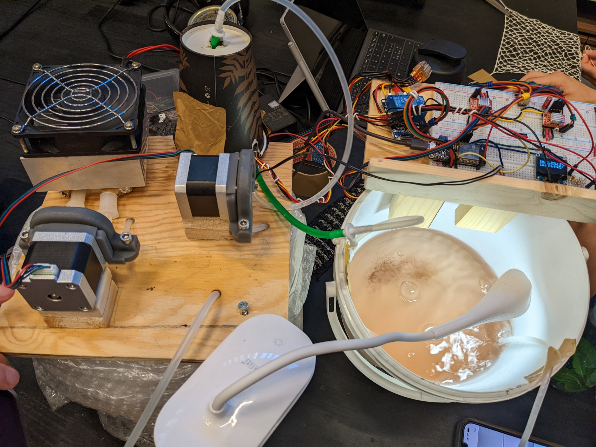
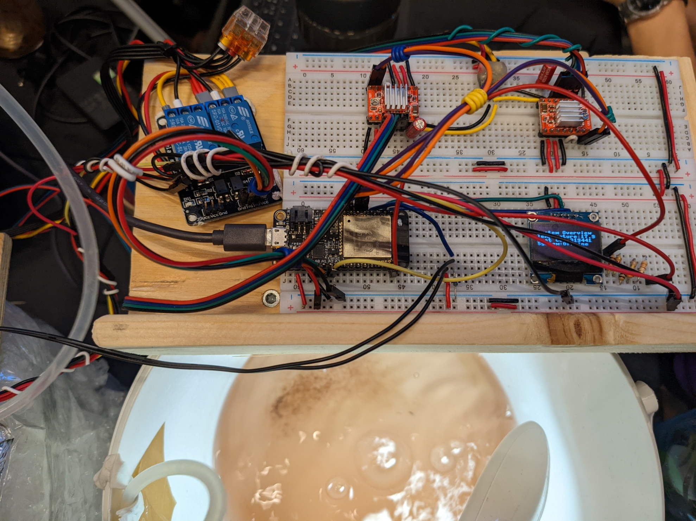
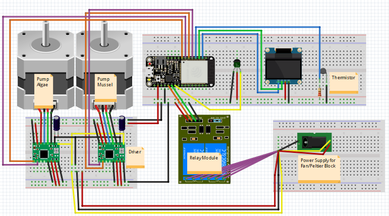
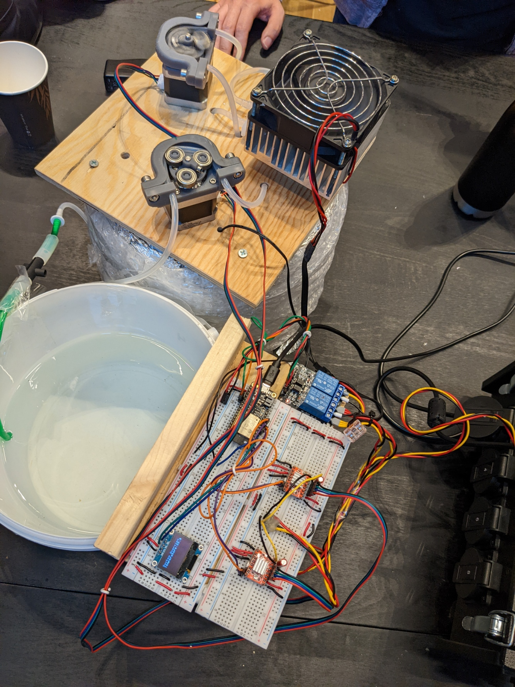
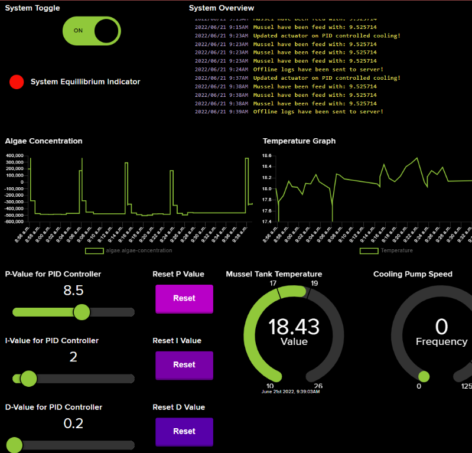
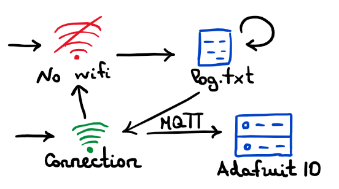
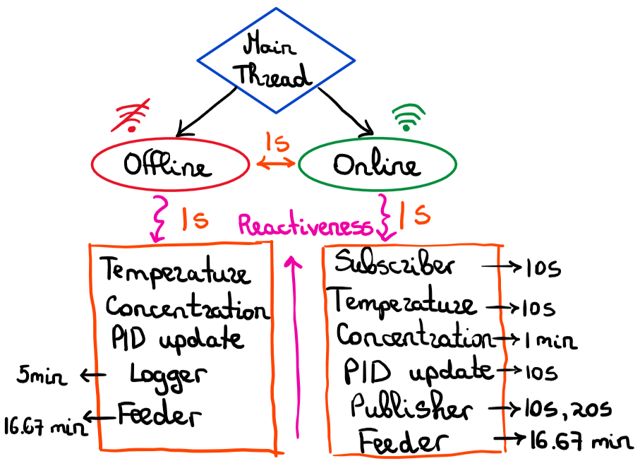

# 𝓜𝓾𝓼𝓼𝓮𝓵 𝓒𝓸𝓷𝓽𝓻𝓸𝓵 𝓢𝔂𝓼𝓽𝓮𝓶 
[TODO Badges here]:<>

## **𝓟𝓻𝓸𝓳𝓮𝓬𝓽 𝓓𝓮𝓼𝓬𝓻𝓲𝓹𝓽𝓲𝓸𝓷**
Project completed in the course 22400 Design-Build 4: Autonomous devices for controlling and studying living systems at Technical University of Denmark (DTU).
The aim of the project is to build a physical control system, growing algae and mussels that are fed with algae liquid according to the system properties.
## **𝓟𝓱𝔂𝓼𝓲𝓬𝓪𝓵 𝓓𝓮𝓼𝓲𝓰𝓷**
The entire system build is presented in the pictures below:

## **𝓟𝓘𝓓 𝓒𝓸𝓷𝓽𝓻𝓸𝓵𝓵𝓮𝓻**
The PID controller has been developed in-house within the project, without any use of libraries, to allow full control over it's parameters. `(See file controllers/PIDController.py)`

After several experiments the parameters have been established to have the following values:

    Proportional - 8.5
    Integral - 2.0
    Derivative - 0.2

## **𝓦𝓮𝓫 𝓘𝓷𝓽𝓮𝓻𝓯𝓪𝓬𝓮**
The Web Interface of the system has been on the Adafruit IO dashboard and allows tuning of the PID coefficients and emergency shutdown of the system.

The graphs for Algae Concentration and Temperature are constantly update with new readings on the feed.
The gauge for temperature shows the current state and the accepted boundaries for the controlled system.
Whenever the system achieves the desired properties, the System Equilibrium Indicator turns green.
While the board is not connected to the internet, the information is stored locally in a log file, according to the following operation scheme:

## **𝓒𝓸𝓷𝓬𝓾𝓻𝓻𝓮𝓷𝓽 𝓔𝔁𝓮𝓬𝓾𝓽𝓲𝓸𝓷**
In order to improve the efficiency and reactiveness of the control system, a simple task scheduler has been developed to allow concurrency on one CPU core.
`(See file build/Concurrency.py)`

The concurrency arhitecture split on threads is presented in the sketch below:

  

